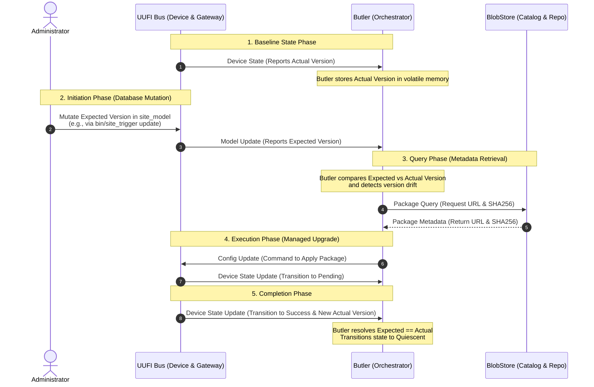

# Software Update Message Sequence

This document contains a sequence diagram illustrating the expected semantic message exchanges for a successful software update orchestration cycle under the Unified UDMI Functional Interface (UUFI) protocol.

<!-- ASSUMPTION: User direct command overrides the general spec edit restrictions of AGENTS.md to create this file -->

## Sequence Diagram

## Description of Phases

### 1. Baseline State Phase
*   **Step 1–2:** The device periodically publishes its current operational parameters on the UUFI bus. The Butler orchestrator receives this **Device State** report, extracting the device's currently running **Actual Version** (`system.software.<blob_id>`) and holding it in volatile in-memory state.

### 2. Initiation Phase
*   **Step 3–4:** An administrator or automated scheduler updates the expected version in the local physical site model. The `site_trigger` utility immediately publishes a **Model Update** message over the UUFI broker to report the new desired **Expected Version** to the orchestrator.

### 3. Query Phase
*   **Step 5:** The Butler orchestrator compares the newly received expected version with the last reported actual version. Detecting a version drift, it triggers the reconciliation loop.
*   **Step 6–7:** Butler sends a **Package Query** to the read-only on-disk Software Catalog (the BlobStore metadata database) to fetch the secure download URL and cryptographic SHA256 hash for the desired update package, which is returned.

### 4. Execution Phase
*   **Step 8:** Butler synthesizes a `blobset` **Config Update** command containing the package download URL and validation parameters, publishing it over the UUFI bus to instruct the target device to apply the update.
*   **Step 9:** The device acknowledges the command, begins downloading the package, and publishes a **Device State Update** on the UUFI bus reporting its status as `pending`.

### 5. Completion Phase
*   **Step 10:** Once the update is successfully applied and verified, the device publishes a final **Device State Update** on the UUFI bus reporting `success`, along with its newly updated **Actual Version** and `lkg_version` parameters.
*   **Step 11:** The Butler receives this success report. Since the reported actual version matches the expected target version, the Butler resolves `Expected == Actual` and transitions the volatile tracking state back to `quiescent`, completing the stateless reconciliation loop.
